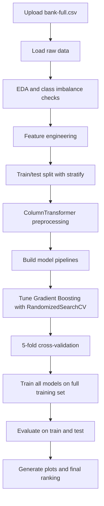
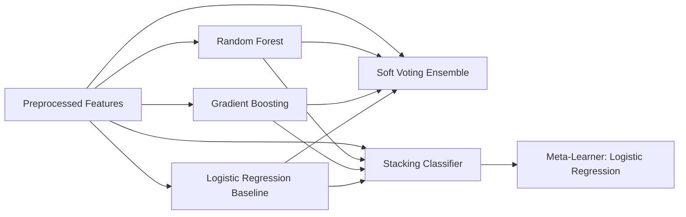

# Ensemble Learning for Bank Marketing Prediction

This project predicts whether a bank client will subscribe to a term deposit using the UCI Bank Marketing dataset (`bank-full.csv`). The core deliverable is a single end-to-end notebook, [`ensemble_bank_marketing.ipynb`](./ensemble_bank_marketing.ipynb), which performs data loading, exploratory analysis, feature engineering, preprocessing, model training, hyperparameter tuning, cross-validation, evaluation, and visualization.

The notebook compares multiple ensemble-learning strategies and a linear baseline:

- Logistic Regression
- Random Forest (bagging)
- Gradient Boosting (tuned)
- Stacking Classifier
- Soft Voting Ensemble

## Project Goal

The target variable is `y`, where:

- `yes` means the client subscribed to a term deposit
- `no` means the client did not subscribe

This is an imbalanced binary classification problem. The notebook explicitly treats PR-AUC as the primary metric because plain accuracy is misleading when most customers belong to the majority class.

## Dataset

- Dataset: UCI Bank Marketing, `bank-full.csv`
- Format: semicolon-delimited CSV
- Recorded dataset size in the notebook run: 45,211 rows
- Original target imbalance: about 88% `No` and 12% `Yes`

Train/test split used in the notebook:

- Train: 36,168 rows
- Test: 9,043 rows
- Split strategy: stratified split to preserve class balance

Test set class distribution from the recorded run:

- `No`: 7,985
- `Yes`: 1,058

## Repository Structure

```text
Ensemble-learning/
|-- data/
|   `-- train.csv
|-- ensemble_bank_marketing.ipynb
`-- README.md
```

Generated during notebook execution:

- `plots/`: output visualizations written by the notebook, including `eda_overview.png`, `confusion_matrices.png`, `roc_curves.png`, `pr_curves.png`, `metric_comparison.png`, `threshold_analysis.png`, and `feature_importances.png`

## End-to-End Workflow



## Feature Engineering

The notebook applies domain-informed feature engineering before splitting the data. These transformations do not use the target during construction, so they do not introduce target leakage.

- `duration` is dropped because it is only known after the call and would leak outcome information.
- `pdays = -1` is split into two signals:
- `was_previously_contacted` is added as a binary flag.
- `pdays` is clipped to `0` so the sentinel value is not treated as a meaningful number.
- `month` is converted into cyclic features:
- `month_sin`
- `month_cos`
- Missingness indicators are added for:
- `contact_missing`
- `poutcome_missing`

Numeric features used after engineering:

- `age`
- `balance`
- `day`
- `campaign`
- `pdays`
- `previous`
- `was_previously_contacted`
- `month_sin`
- `month_cos`
- `contact_missing`
- `poutcome_missing`

Categorical features used after engineering:

- `job`
- `marital`
- `education`
- `default`
- `housing`
- `loan`
- `contact`
- `poutcome`

## Preprocessing

The notebook uses a `ColumnTransformer` inside every model pipeline.

- Numeric columns are scaled with `StandardScaler`
- Categorical columns are encoded with `OneHotEncoder`
- `drop='first'` is used to reduce multicollinearity for logistic regression
- `handle_unknown='ignore'` prevents inference-time failures on unseen categories

This design is important because preprocessing is re-fit inside each cross-validation fold, which keeps validation leakage out of the experiment.

## Models Compared



### 1. Logistic Regression

- Used as the baseline linear model
- `class_weight="balanced"`
- Regularized with `C=0.5`

### 2. Random Forest

- Ensemble type: bagging
- Key regularization:
- `n_estimators=200`
- `max_depth=10`
- `min_samples_leaf=5`
- `max_features="sqrt"`
- `class_weight="balanced_subsample"`

### 3. Gradient Boosting

- Ensemble type: boosting
- Tuned with `RandomizedSearchCV`
- Search metric: `average_precision` (PR-AUC)
- Best tuned parameters from the recorded run:
- `n_estimators=200`
- `learning_rate=0.05`
- `max_depth=5`
- `subsample=0.8`
- `min_samples_split=5`
- `min_samples_leaf=10`

### 4. Stacking Classifier

- Ensemble type: stacking
- Uses base learners from the tree and linear models
- Final estimator: Logistic Regression
- Learns from out-of-fold predictions rather than raw feature reuse alone

### 5. Soft Voting Ensemble

- Ensemble type: probability averaging
- Combines model probabilities instead of hard class labels
- Uses weighted voting with weights `[1, 2, 3]`

## Validation Strategy

- Train/test split with stratification
- 3-fold CV for Gradient Boosting hyperparameter search
- 5-fold cross-validation for model comparison
- Metrics used:
- PR-AUC as the primary metric
- ROC-AUC for ranking quality
- F1 for precision/recall balance
- Accuracy included, but not treated as the main decision metric

## Cross-Validation Results

Results reported by the notebook on the training set:

| Model | ROC-AUC | PR-AUC | F1 (macro) |
|---|---:|---:|---:|
| Logistic Regression (baseline) | 0.7450 ± 0.0034 | 0.3656 ± 0.0074 | 0.5745 ± 0.0033 |
| Random Forest (Bagging) | 0.7916 ± 0.0033 | 0.4317 ± 0.0119 | 0.6688 ± 0.0072 |
| Stacking Classifier | 0.7948 ± 0.0034 | 0.4416 ± 0.0142 | 0.6599 ± 0.0090 |
| Soft Voting Ensemble | 0.7917 ± 0.0022 | 0.4411 ± 0.0134 | 0.6786 ± 0.0072 |
| Gradient Boosting [Tuned] | 0.7986 ± 0.0038 | 0.4461 ± 0.0141 | 0.6408 ± 0.0078 |

## Test Set Results

Final recorded test-set metrics from the notebook:

| Model | Accuracy | Precision | Recall | F1 | ROC-AUC | PR-AUC |
|---|---:|---:|---:|---:|---:|---:|
| Logistic Regression (baseline) | 0.6986 | 0.2301 | 0.6720 | 0.3428 | 0.7551 | 0.3665 |
| Random Forest (Bagging) | 0.8200 | 0.3494 | 0.6248 | 0.4481 | 0.7986 | 0.4400 |
| Stacking Classifier | 0.8065 | 0.3327 | 0.6503 | 0.4402 | 0.8022 | 0.4544 |
| Soft Voting Ensemble | 0.8914 | 0.5552 | 0.3611 | 0.4376 | 0.8005 | 0.4556 |
| Gradient Boosting [Tuned] | 0.8956 | 0.6397 | 0.2467 | 0.3561 | 0.8040 | 0.4660 |

## Best Model

According to the notebook's final ranking by PR-AUC, the best model is:

- Gradient Boosting [Tuned]
- PR-AUC: `0.4660`
- ROC-AUC: `0.8040`
- F1: `0.3561`

Important trade-off observed in the notebook:

- Gradient Boosting achieved the best PR-AUC and the highest accuracy.
- Soft Voting and Stacking offered stronger balance in some secondary metrics.
- Random Forest and Gradient Boosting showed larger train-test gaps in PR-AUC, so the notebook explicitly flags possible overfitting risk.

## Why PR-AUC Matters Here

Because positive subscriptions are much rarer than negative outcomes, PR-AUC is more informative than accuracy alone.

- A model can look strong on accuracy by mostly predicting `No`
- PR-AUC focuses on how well the model identifies actual subscribers
- This makes it a better metric for campaign targeting problems

## Visual Outputs

The notebook generates plots to make model behavior easier to interpret:

- EDA overview for class balance and age distribution
- Confusion matrices for all models
- ROC curves
- Precision-recall curves
- Metric comparison bar chart
- Threshold analysis for precision/recall trade-offs
- Feature importance plots for tree-based models

## How To Run

This notebook is written to run in Google Colab.

1. Open [`ensemble_bank_marketing.ipynb`](./ensemble_bank_marketing.ipynb).
2. Run the cells from top to bottom.
3. Upload `bank-full.csv` when prompted in the first step.
4. Wait for preprocessing, tuning, model training, and evaluation to finish.
5. Review the generated plots and final performance summary.

## Dependencies

The notebook checks versions for these libraries:

- scikit-learn
- pandas
- numpy
- matplotlib
- seaborn

The import section also uses standard Python modules such as `os`, `copy`, `logging`, and `warnings`.

## Key Takeaways

- The project is a full ensemble-learning benchmark for bank marketing response prediction.
- It is designed to minimize leakage by keeping preprocessing inside pipelines.
- It uses feature engineering grounded in the dataset's semantics rather than generic transformations.
- It evaluates models with metrics appropriate for class imbalance.
- It records both predictive performance and overfitting gaps instead of reporting a single accuracy number.
